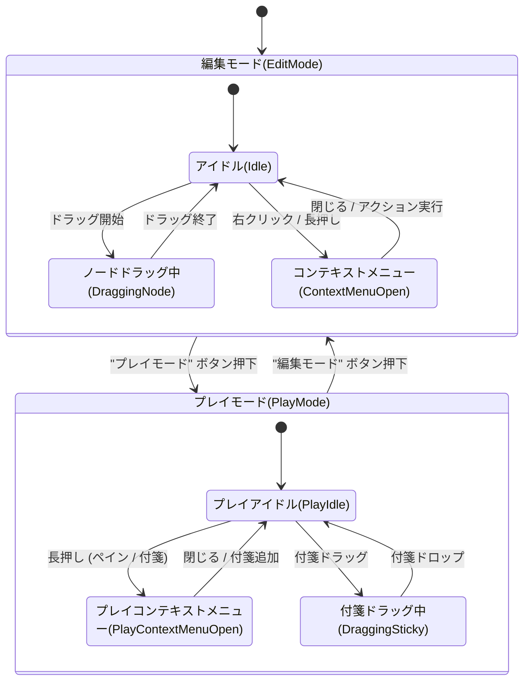

# システム概要 (System Overview)

**文書バージョン**: 1.0.2
**最終更新日**: 2025-12-13
**対象バージョン**: 1.0.2

## 1. 概要
**TRPG Scenario Manager** は、TRPGシナリオを視覚的に作成・管理するためのWebアプリケーションである。
React Flowを用いたノードベースのインターフェースを提供し、イベント、条件分岐、リソース管理などを直感的に構築できる。
PWAとしての利用やモバイルデバイスでの操作も考慮されており、ローカルストレージを用いたデータ永続化機能を備える。

## 2. 定義と前提
### 2.1 関連ドキュメント
- [01_Data_Models.md](./01_Data_Models.md): データ構造詳細
- [02_Core_Logic.md](./02_Core_Logic.md): アプリケーションロジック
- [03_UI_Interaction.md](./03_UI_Interaction.md): UI/UX仕様
- [04_Visual_Design.md](./04_Visual_Design.md): デザインシステム
- [05_Debug_Features.md](./05_Debug_Features.md): デバッグ機能
- [Implementation_Gap_Report.md](./Implementation_Gap_Report.md): 実装不一致レポート

## 3. 技術スタック
| カテゴリ | 技術・ライブラリ | 用途 |
| :--- | :--- | :--- |
| **Frontend** | React 19, TypeScript 5.9 | UI構築, 型安全性 |
| **Build Tool** | Vite 5.4 | 高速なビルド・開発環境 |
| **UI Framework** | React Flow 11.11 | ノードベースエディタの中核 |
| **Styling** | Tailwind CSS 3.4, clsx, tailwind-merge | スタイリング、クラス結合 |
| **State Management** | Zustand 5.0 | グローバル状態管理 |
| **Icons** | Lucide React | SVGアイコンセット |
| **Utils** | React Markdown, Remark GFM | Markdownレンダリング（ヘルプ等） |
| **Other** | React Rnd, React Window | フローティングウィンドウ, 仮想スクロール |

## 4. 全体アーキテクチャ
### 4.1 ディレクトリ構成
```
src/
├── components/     # Reactコンポーネント (Atomic Design準拠ではない)
│   ├── DebugPanel/ # デバッグ機能一式
│   └── common/     # 汎用UIパーツ (Modal, Portal等)
├── edges/          # React Flow カスタムエッジ
├── nodes/          # React Flow カスタムノード
├── store/          # Zustand ストア定義 (scenarioStore, debugStore)
├── types/          # 型定義 (*.ts)
├── utils/          # ユーティリティ関数
├── i18n/           # ローカライズ定義
└── hooks/          # カスタムフック
```

## 5. 状態遷移図 (State Diagram)
アプリケーションの主要なモード遷移を以下に示す。



---
*End of Document*
