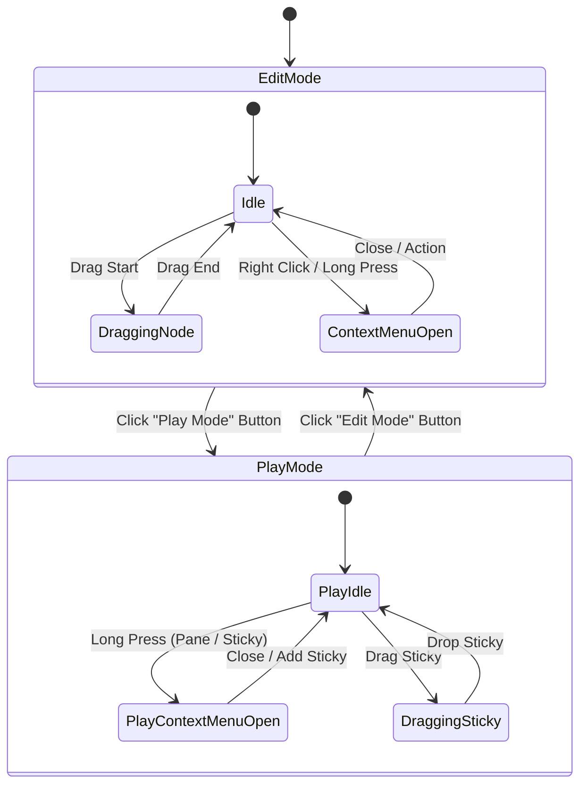
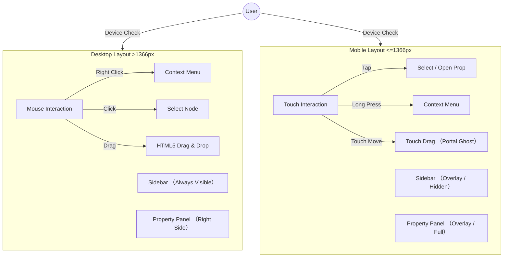

# Requirement Specification Diagrams

## State Transition Diagram
<!-- id: state-transition-diagram -->

```mermaid
stateDiagram-v2
    [*] --> EditMode
    
    state EditMode {
        [*] --> Idle
        Idle --> DraggingNode : Drag Start
        DraggingNode --> Idle : Drag End
        Idle --> ContextMenuOpen : Right Click / Long Press
        ContextMenuOpen --> Idle : Close / Action
    }

    state PlayMode {
        [*] --> PlayIdle
        PlayIdle --> PlayContextMenuOpen : Long Press (Pane / Sticky)
        PlayContextMenuOpen --> PlayIdle : Close / Add Sticky
        PlayIdle --> DraggingSticky : Drag Sticky
        DraggingSticky --> PlayIdle : Drop Sticky
    }

    EditMode --> PlayMode : Click "Play Mode" Button
    PlayMode --> EditMode : Click "Edit Mode" Button
```

## Layout & Interaction Matrix

```mermaid
graph TD
    User((User))
    
    subgraph Desktop [Desktop Layout >1366px]
        D_Mouse[Mouse Interaction]
        D_Sidebar[Sidebar （Always Visible）]
        D_Prop[Property Panel （Right Side）]
        D_DnD[HTML5 Drag & Drop]
        
        D_Mouse -->|Right Click| D_Ctx[Context Menu]
        D_Mouse -->|Click| D_Select[Select Node]
        D_Mouse -->|Drag| D_DnD
    end
    
    subgraph Mobile [Mobile Layout <=1366px]
        M_Touch[Touch Interaction]
        M_Sidebar[Sidebar （Overlay / Hidden）]
        M_Prop[Property Panel （Overlay / Full）]
        M_TouchDnD[Touch Drag （Portal Ghost）]
        
        M_Touch -->|Tap| M_Select[Select / Open Prop]
        M_Touch -->|Long Press| M_Ctx[Context Menu]
        M_Touch -->|Touch Move| M_TouchDnD
    end
    
    User -->|Device Check| Desktop
    User -->|Device Check| Mobile
```
