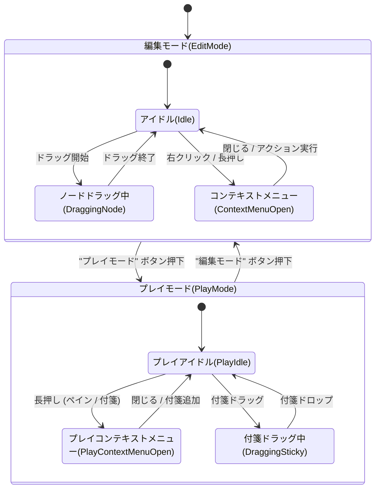
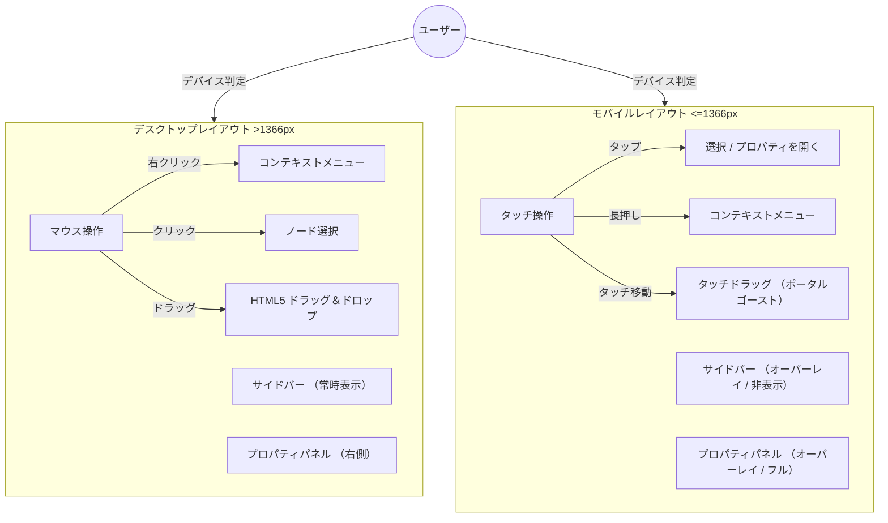

# 要件定義書 図解 (Requirement Specification Diagrams)

## 状態遷移図 (State Transition Diagram)
<!-- id: state-transition-diagram -->

```mermaid
stateDiagram-v2
    [*] --> 編集モード(EditMode)
    
    state 編集モード(EditMode) {
        [*] --> アイドル(Idle)
        アイドル(Idle) --> ノードドラッグ中(DraggingNode) : ドラッグ開始
        ノードドラッグ中(DraggingNode) --> アイドル(Idle) : ドラッグ終了
        アイドル(Idle) --> コンテキストメニュー(ContextMenuOpen) : 右クリック / 長押し
        コンテキストメニュー(ContextMenuOpen) --> アイドル(Idle) : 閉じる / アクション実行
    }

    state プレイモード(PlayMode) {
        [*] --> プレイアイドル(PlayIdle)
        プレイアイドル(PlayIdle) --> プレイコンテキストメニュー(PlayContextMenuOpen) : 長押し (ペイン / 付箋)
        プレイコンテキストメニュー(PlayContextMenuOpen) --> プレイアイドル(PlayIdle) : 閉じる / 付箋追加
        プレイアイドル(PlayIdle) --> 付箋ドラッグ中(DraggingSticky) : 付箋ドラッグ
        付箋ドラッグ中(DraggingSticky) --> プレイアイドル(PlayIdle) : 付箋ドロップ
    }

    編集モード(EditMode) --> プレイモード(PlayMode) : "プレイモード" ボタン押下
    プレイモード(PlayMode) --> 編集モード(EditMode) : "編集モード" ボタン押下
```

## レイアウト & インタラクション マトリクス (Layout & Interaction Matrix)

```mermaid
graph TD
    User((ユーザー))
    
    subgraph Desktop [デスクトップレイアウト >1366px]
        D_Mouse[マウス操作]
        D_Sidebar[サイドバー （常時表示）]
        D_Prop[プロパティパネル （右側）]
        D_DnD[HTML5 ドラッグ＆ドロップ]
        
        D_Mouse -->|右クリック| D_Ctx[コンテキストメニュー]
        D_Mouse -->|クリック| D_Select[ノード選択]
        D_Mouse -->|ドラッグ| D_DnD
    end
    
    subgraph Mobile [モバイルレイアウト <=1366px]
        M_Touch[タッチ操作]
        M_Sidebar[サイドバー （オーバーレイ / 非表示）]
        M_Prop[プロパティパネル （オーバーレイ / フル）]
        M_TouchDnD[タッチドラッグ （ポータルゴースト）]
        
        M_Touch -->|タップ| M_Select[選択 / プロパティを開く]
        M_Touch -->|長押し| M_Ctx[コンテキストメニュー]
        M_Touch -->|タッチ移動| M_TouchDnD
    end
    
    User -->|デバイス判定| Desktop
    User -->|デバイス判定| Mobile
```
